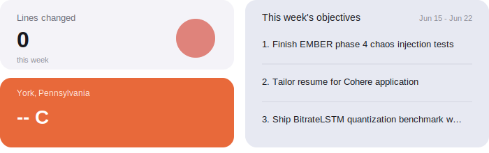

<h1 align="center">Justin Tulloch</h1>

## Hiring spotlight
Distributed systems · Test infrastructure · Data platforms · Real time engines

## Tech I use

  <code>Python</code>
  <code>Rust</code>
  <code>Go</code>
  <code>C++</code>
  <code>Java</code>
  <code>Kafka</code>
  <code>gRPC</code>
  <code>Kubernetes</code>
  <code>PostgreSQL</code>
  <code>Redis</code>
  <code>Spark/Flink</code>
  <code>ClickHouse</code>
  <code>Parquet</code>
  <code>Bazel</code>
  <code>GitHub Actions</code>
  <code>OpenTelemetry</code>
  <code>Prometheus</code>

## How I work
<ul>
  <li>Small PRs and clear docs</li>
  <li>Trace first and measure before and after</li>
  <li>SLO gates with rollouts that stop on red</li>
  <li>Simple dashboards that match the truth</li>
</ul>

<!--
**justintulloch/JustinTulloch** is a ✨ _special_ ✨ repository because its `README.md` (this file) appears on your GitHub profile.

Here are some ideas to get you started:

- 🔭 I’m currently working on ...
- 🌱 I’m currently learning ...
- 👯 I’m looking to collaborate on ...
- 🤔 I’m looking for help with ...
- 💬 Ask me about ...
- 📫 How to reach me: ...
- 😄 Pronouns: ...
- ⚡ Fun fact: ...
-->
